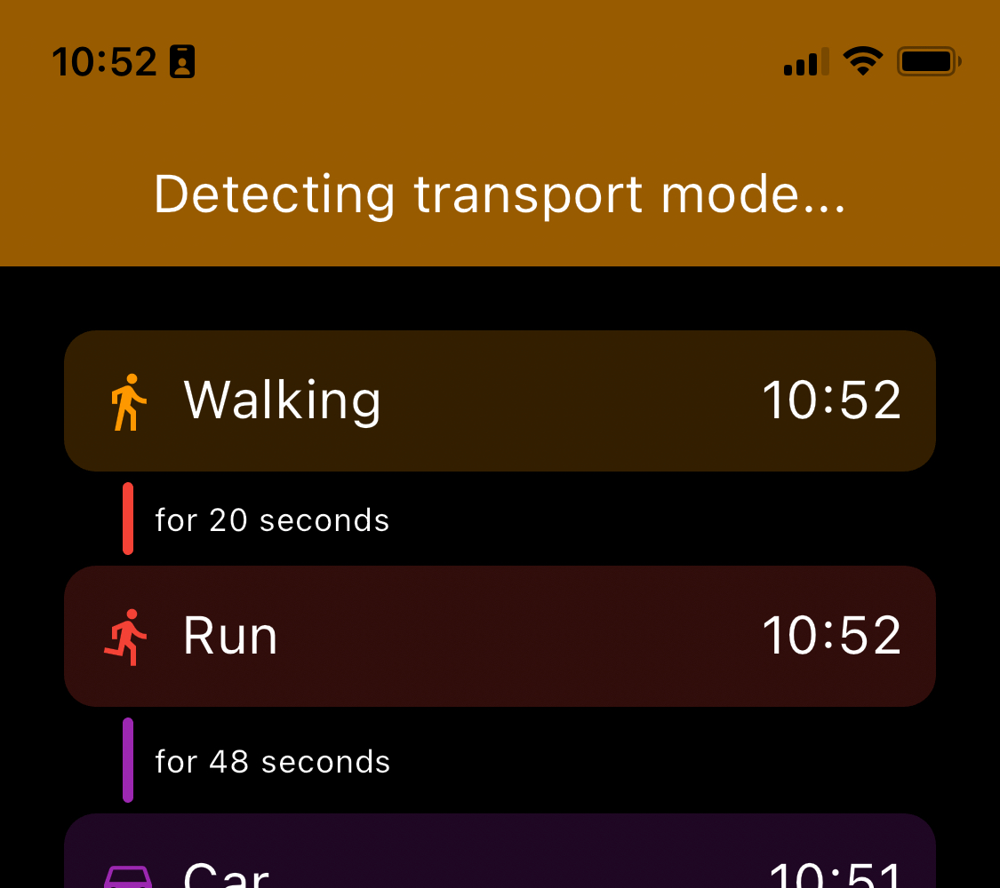
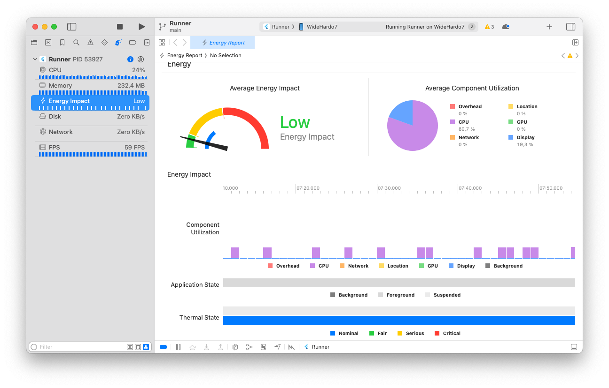

# Transport Mode Detection for Smartphones

TFLite Machine learning models trained for transport mode detection (TMD) on smartphones. This library provides a simple API to use these models in your Flutter app. The models were trained and evaluated on the SHL (Sussex-Huawei-Locomotion) dataset.



## Installing

Add this library to your `pubspec.yaml` via GitHub:

```yaml
dependencies:
  tmd:
    git:
      url: https://github.com/philippmatthes/tmd
      ref: main
```

## Example Usage

```dart
import 'package:tmd/tmd.dart';

void main() async {
  final tmd = TMD();
  final stream = await tmd.startListeningForChanges()
  stream.listen((newMode) {
    print(newMode); // New transport mode detected
  });
}
```

There is also the option to specify how often the model should be evaluated, and how often the changed transport mode should be cross-checked before reporting the change.

```dart
import 'package:tmd/tmd.dart';

void main() async {
  final tmd = TMD();
  final stream = await tmd.startListeningForChanges(
    // Notify only if a new transport mode was detected that many
    // consecutive times. This will improve the stability at the
    // expense of a less frequent notification.
    nChangedForNotification: 5,
    // The inference period defines how often the transport mode
    // is inferred. This will also affect the notification frequency.
    // Note that the inference period also impacts the battery life.
    // It is recommended to not go below 0.5 seconds.
    inferencePeriod: const Duration(milliseconds: 1000),
  );
  stream.listen((newMode) {
    print(newMode); // New transport mode detected
  });
}
```

## Designed for Low Resource Usage



Read our paper to learn more about how we optimized the model for low resource usage: [Selecting Resource-Efficient ML Models for Transport Mode Detection on Mobile Devices](https://ieeexplore.ieee.org/abstract/document/9976004/).

## Known Issues

- Currently, the IMU sensor stream is kept active even when the transport mode detection does not need it.
- Transport mode "car" may be detected instead of "still" when the smartphone lays flat on the table.
- The detection may vary between devices depending on the sensor quality and sampling rate.

Please help us improve this library by cross-checking results and reporting any issues you encounter.

## TFLite Models Download

The model in the first row is the model used by default in this library.

| Model ID | Type | Pooling | Optimizer | Optimization | Depth | LR | Val. Acc. (%) | Download |
| --- | --- | --- | --- | --- | --- | --- | --- | --- |
|4ad2e7|1d ResNetV1|max|adam|Pruning & Separable Layers|2|0.010|84.91|[Google Drive](https://drive.google.com/file/d/1-JH0K0vsLOuqiTp2PAIPoLXRUyvvk36p/view?usp=sharing)|
|4ad2e7|1d ResNetV1|max|adam|Pruning|2|0.010|84.38|[Google Drive](https://drive.google.com/file/d/1Dj7Op4LArlK0gnkGpqvbj6uetNlxNSL3/view?usp=sharing)|
|4ad2e7|1d ResNetV1|max|adam|-|2|0.010|84.34|[Google Drive](https://drive.google.com/file/d/1-CyUZTibwya5l2j2l_StHtYe_u2tOJ04/view?usp=sharing)|
|6af8a1|1d ResNetV1|max|adam|-|4|0.010|84.18|[Google Drive](https://drive.google.com/file/d/1-LkSVciKyGQkO6YyAqHazqArNhfgc5U3/view?usp=sharing)|
|7cfd66|1d ResNetV1|max|sgd|-|2|0.100|84.18|[Google Drive](https://drive.google.com/file/d/1-8kybhtQut8Mz-6zz0UfFssz_t_yqCGQ/view?usp=sharing)|
|968ca3|1d ResNetV1|max|sgd|-|2|0.100|84.03|[Google Drive](https://drive.google.com/file/d/1-1UjIR3Qs-2oZD49AVnbmPpeLG05iKDJ/view?usp=sharing)|
|e6c367|1d ResNetV1|avg|adam|-|3|0.001|83.69|[Google Drive](https://drive.google.com/file/d/1-1Uurz7PfFuw9-wdV-DfH7EQGEFgopZs/view?usp=sharing)|
|998822|1d ResNetV2|max|sgd|-|2|0.010|82.92|[Google Drive](https://drive.google.com/file/d/1-_hmv7INFEIGTRC2Lz7H8NJCEC22zFLI/view?usp=sharing)|
|752315|2d ResNetV2|avg|rmsprop|-|2|0.010|81.33|[Google Drive](https://drive.google.com/file/d/1-4n6KBRXdm2Dz-D6tZHM4NYsf-d40FSj/view?usp=sharing)|
|35d171|2d ResNetV1|avg|adam|-|2|0.010|81.07|[Google Drive](https://drive.google.com/file/d/1-8DgA9znYzIKrfPmHxaCgkz8VPFRaswu/view?usp=sharing)|
|ea7037|1d ResNetV1|avg|adam|-|3|0.001|81.01|[Google Drive](https://drive.google.com/file/d/1-ROstQ3WI8ZtCy8xDzDMg-UhFlT8wC8s/view?usp=sharing)|
|cb5048|2d ResNetV1|max|adam|-|2|0.010|78.96|[Google Drive](https://drive.google.com/file/d/1-00pwU2B3yer4jPU4Wp_oP2OIVCNwB_5/view?usp=sharing)|

All models were trained and evaluated on the SHL dataset. If any of the download links do not work, here is a backup: [Google Drive](https://drive.google.com/file/d/15XombGG_j4ngN7l-tNMKB4WnXqRv6G7o/view?usp=sharing). Please open an issue in this case.

## Citing this Work

```bibtex
@inproceedings{matthes2022selecting,
  title={Selecting Resource-Efficient ML Models for Transport Mode Detection on Mobile Devices},
  author={Matthes, Philipp and Springer, Thomas},
  booktitle={2022 IEEE International Conference on Internet of Things and Intelligence Systems (IoTaIS)},
  pages={135--141},
  year={2022},
  organization={IEEE}
}
```
